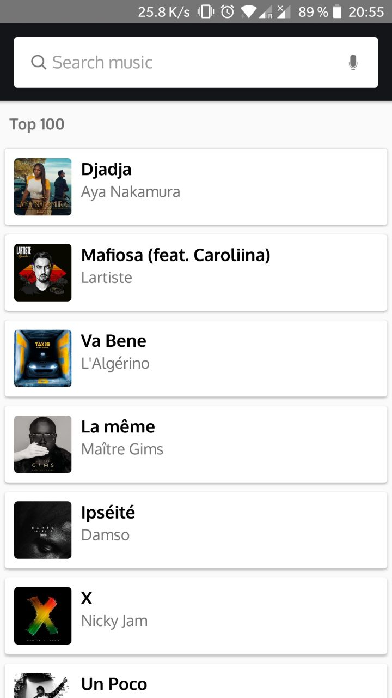
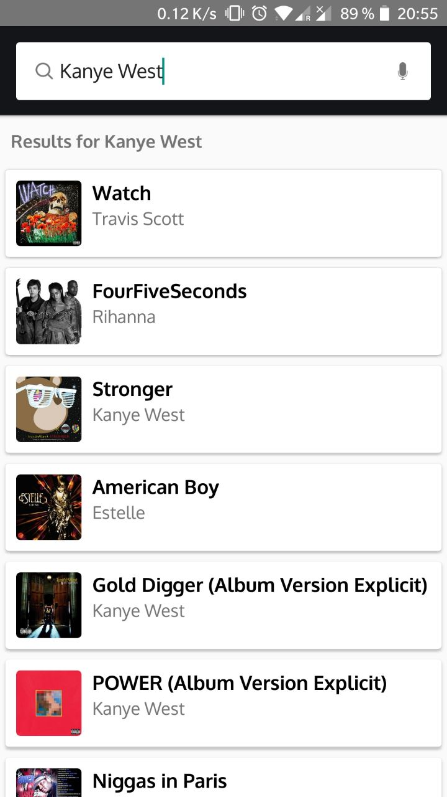
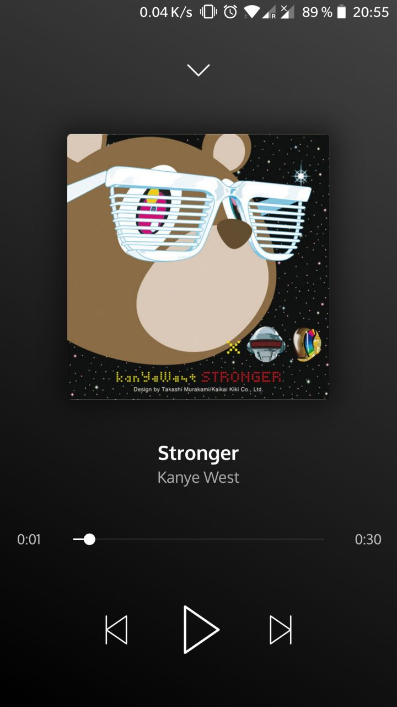

K-Play is a sample Android application using the [Deezer SDK](https://developers.deezer.com/sdk/android).

# Screenshots

  
  
  

# Technologies used

This project is developped in Kotlin, and uses [the CLEAN architecture.](https://8thlight.com/blog/uncle-bob/2012/08/13/the-clean-architecture.html)

# Main libraries used

* Dagger2
* RxJava2
* Retrofit2
* Glide
* [Deezer SDK](https://developers.deezer.com/sdk/android)